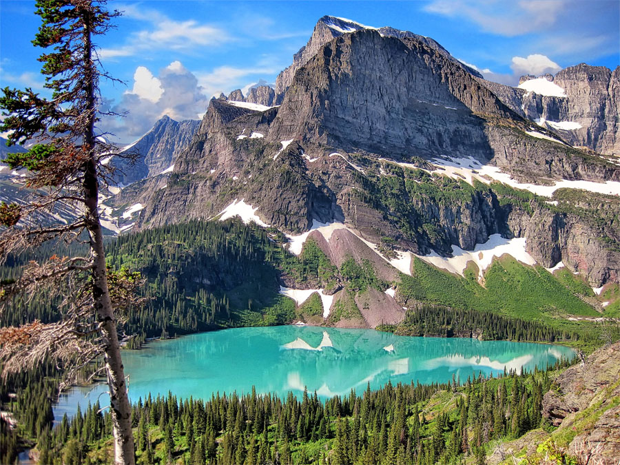

## Columbia Falls, Montana

Glacier National Park is an American national park located in northwestern Montana, on the Canada–United States border, adjacent to the Canadian provinces of Alberta and British Columbia.

The park encompasses over 1 million acres (4,000 square km) and includes parts of two mountain ranges (sub-ranges of the Rocky Mountains), over 130 named lakes, more than 1,000 different species of plants, and hundreds of species of animals.

This vast pristine ecosystem is the centerpiece of what has been referred to as the "Crown of the Continent Ecosystem," a region of protected land encompassing 16,000 square miles (41,000 square km).