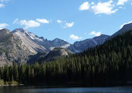

  
## Colorado, USA

Rocky Mountain National Park is an American national park located approximately 76 mi (122 km) northwest of Denver International Airport in north-central Colorado, within the Front Range of the Rocky Mountains

The park is situated between the towns of Estes Park to the east and Grand Lake to the west. The eastern and western slopes of the Continental Divide run directly through the center of the park with the headwaters of the Colorado River located in the park's northwestern region.

The main features of the park include moutains alpine lakes and a wide variety  of wildlife within various climates and envrionments, from wooded forests to mountains.

