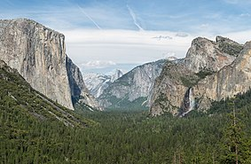

## Yosemite, California

Yosemite National Park is an American national park located in the western Sierra Nevada of Central California, bounded on the southeast by Sierra National Forest and on the northwest by Stanislaus National Forest.

The park is managed by the National Park Service and covers an area of 748,436 acres (1,169 square mi; 3,029 square km) and sits in four counties: centered in Tuolumne and Mariposa, extending north and east to Mono and south to Madera County.

Designated a World Heritage site in 1984, Yosemite is internationally recognized for its granite cliffs, waterfalls, clear streams, giant sequoia groves, lakes, mountains, meadows, glaciers, and biological diversity. Almost 95% of the park is designated wilderness.